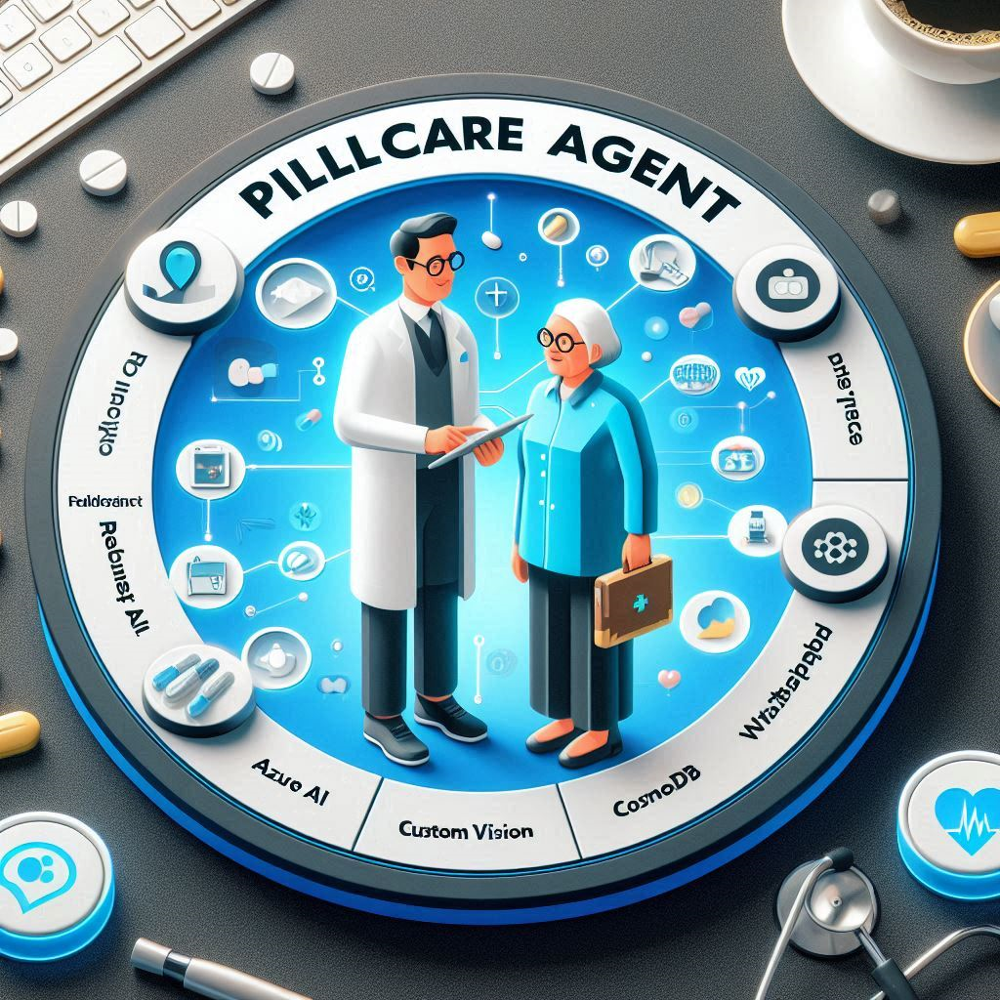
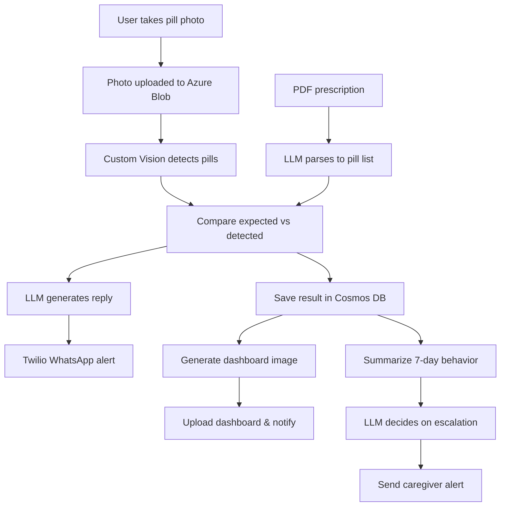

# PillCare: A Responsible AI Agent for Daily Medication Monitoring

**Category**: Azure AI Agent Service  /  Best in Python   
**Team**: Alex Rozenberg, PhD  
**Platforms**: Azure AI Agents + Custom Vision + Cosmos DB + Azure Blob + Twilio WhatsApp + Colab

---


## Overview

PillCare is a fully automated AI agent that assists elderly users in tracking and adhering to their daily medication routines. It combines Azure AI Agent reasoning, Custom Vision image analysis, CosmosDB memory, and Twilio WhatsApp messaging into one cohesive healthcare assistant.

The solution was designed and tested using Python in Google Colab and integrates deeply with Azure cloud infrastructure.

---

## Key Features

### 1. **Responsible AI Agent Interaction (Azure OpenAI)**
- Empathetic, natural-language replies to seniors
- Dual-language support (English + Romanian)
- Transparent decision-making for users and caregivers

### 2. **Photo-Based Pill Recognition (Azure Custom Vision)**
- User sends a photo of daily pills
- Model detects and tags visible medications

### 3. **Prescription Parsing with LLM**
- Extracts structured data from scanned PDF prescriptions
- LLM converts text to a `{pill: quantity}` dictionary

### 4. **Intelligent Comparison & Memory Logging**
- Compares expected vs detected pills
- Logs each day’s results into CosmosDB
- Stores image, PDF, reply, and chart in Blob Storage

### 5. **Escalation Logic & Trend Analysis**
- Agent evaluates 7-day behavior history
- Decides when to escalate to a caregiver
- Generates weekly dashboards

### 6. **Human-in-the-Loop via WhatsApp (Twilio)**
- Two-way communication with user
- WhatsApp alerts for missed pills or photo
- Escalations sent to verified family member

---

## Technical Architecture



---

## How to Run (Colab)

1. Upload this repo to Google Colab
2. Install required packages:
```python
!pip install azure-cosmos azure-storage-blob PyPDF2 twilio matplotlib
```
3. Upload the required demo files to `/content/`:
```python
run_daily_pillcare_check("Alex", "/content/pill_photo.jpeg", "/content/prescription.pdf")
```

### Required Files

To test the project, upload these files to Colab:

- **pill_photo.jpeg**: A sample photo of pills
- **prescription.pdf**: With this content:
```
Prescription
Patient: John Doe
- Attent - 1 pill daily
- Dexamol - 2 pills daily
- Advil - 3 pills daily
```

Alternatively, include them in your repo under a `demo_assets` folder:
```
demo_assets/pill_photo.jpeg
demo_assets/prescription.pdf
```
Then update your script call accordingly.

---

## Submission Checklist

- [x] Innovation: creative agent + WhatsApp integration
- [x] Impact: useful for seniors and caregivers
- [x] Usability: photo → insight in 1 step
- [x] Human-in-the-Loop: escalation logic, communication
- [x] Responsible AI: soft LLM tone, explanations, memory
- [x] Technical completeness: storage, memory, agent, charts
- [x] README, demo, code structure all included

---

## Example WhatsApp Output

**User:** Sends photo + prescription

**Agent:**
> Today I detected: Dexamol, Advil.
> Expected: Dexamol(2), Advil(3).
> Missing: Dexamol(1), Advil(2).
>
> You’ve missed pills for 3 of the last 7 days. Please try to improve. Also in Romanian: Vă rugăm să vă asigurați că luați toate medicamentele prescrise.

**Escalation:**
> 🚨 Escalation triggered. Please check on your loved one.

---

## Future Improvements & Enhancements

The PillCare agent lays a solid foundation for medication adherence monitoring. Future directions could expand capabilities and accessibility:

### 🔄 Enhanced Interaction
- Let users ask freeform health questions or request specific graphs on the fly (e.g. "Show me all days Advil was missed")
- Use agent tool-calling or code interpreter to answer data queries in real time

### 🧠 Smarter Reasoning & Reliability
- Analyze long-term behavior trends and alert caregivers to changes
- Cross-reference pill detection with time-of-day expectations (e.g. 2 doses/day)
- Validate prescription expiration or refill needs automatically

### 📲 Broader Input Channels
- Upload daily pill photos via phone camera or IoT pillbox devices
- Enable voice-based reporting (speech-to-text and text-to-speech)
- Support additional languages beyond English and Romanian

### 🚨 Expanded Escalation Options
- Offer emergency trigger if user stops responding
- Provide context-rich reports to caregivers (pill history, adherence trends)
- Notify pharmacies or doctors when anomalies persist

### 💊 Vision Improvements
- Improve pill detection with more robust image model
- Support classification of similar-looking pills using better training sets

### 🌐 Transition to Production-Ready Azure Environment
- Migrate infrastructure to Azure for scalable, secure deployment.
- Adopt Azure tools like Key Vault and Kubernetes Service for reliability.

These enhancements would help scale PillCare into a deployable healthcare product while maintaining ethical and accessible AI practices.

---

## Secrets Remark

In the context of the hackathon, I chose to hardcode secrets (such as API keys) directly in my Python Google Colab notebook because it was the fastest and most practical approach. Given the time constraints, this method allowed me to focus on delivering results efficiently. Since the keys were temporary trial credentials, and I could regenerate them as needed, the security implications were minimized in this specific scenario.
That said, I fully understand that hardcoding secrets is not a best practice in production environments or long-term projects due to the potential security risks. Best practices recommend avoiding hardcoding secrets and instead leveraging secure methods to manage them effectively

---

## License & Credits

This submission is part of the Microsoft AI Agents Hackathon. Code and design by Alex Rozenberg. All services used are free-tier or under the Azure free trial program.

Special thanks to:
- Microsoft Azure and the AI Agents Hackathon team
- ChatGPT by OpenAI – for collaborative design and development support
---

## Questions?
Feel free to reach out to rz.alex@gmail.com or connect via LinkedIn.

